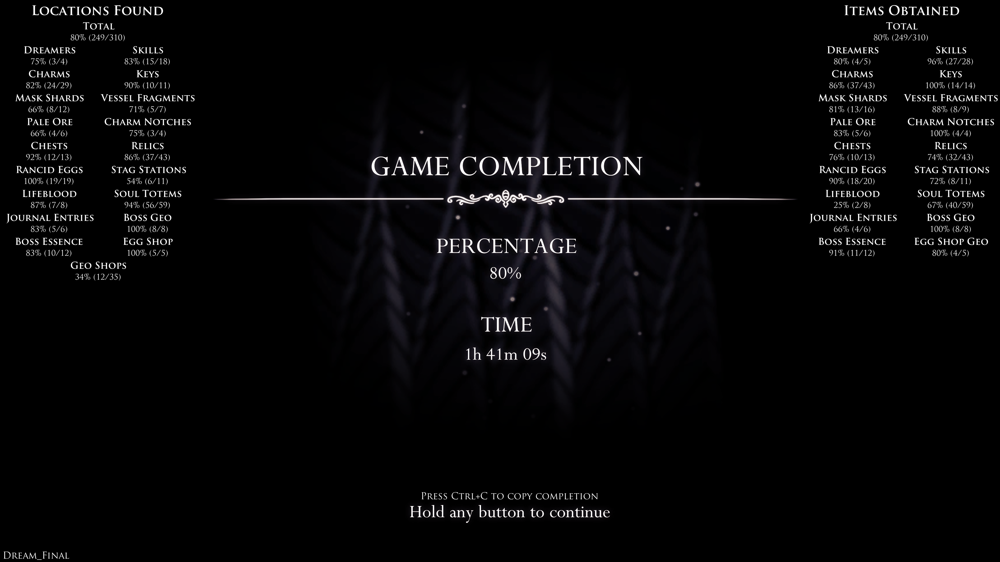
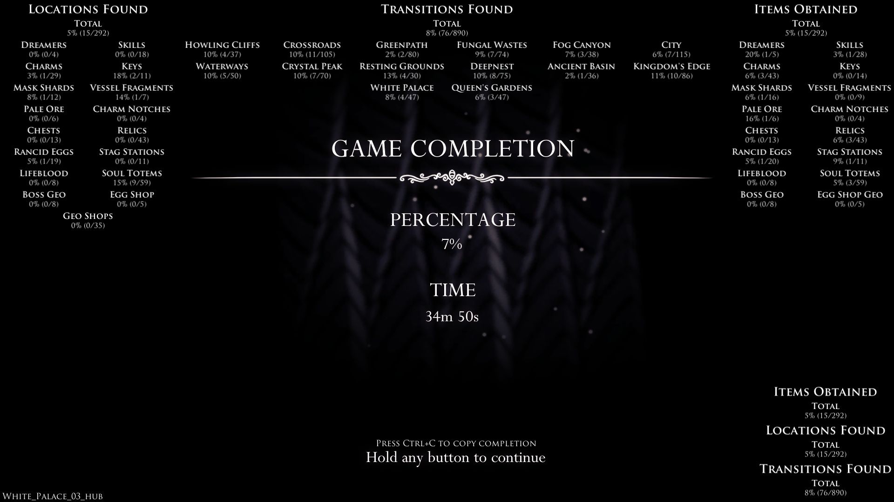

# Rando3Stats

Rando3Stats is a Hollow Knight mod used with Randomizer Mod 3 on patch 1.4.3.2 (not to be confused with 
RandomizerMod3.5 for patch 1.5). It provides detailed statistics about your obtained checks on the 
completion screen after the credits, and various quality-of-life changes to make it easier to view and
share your stats.

*End screen after a completed game*

*Skipping to a customized end screen*

## Compatibility

| Mod/Version | Compatibility | Download |
| --- | --- | --- |
| RandomizerMod3 v3.13(288) (current) |  | [link](https://github.com/homothetyhk/HollowKnight.RandomizerMod/releases/tag/v3.13(288)) |
| ItemSync v1.3.0 (current) |  | [link](https://github.com/Shadudev/HollowKnight.MultiWorld/releases/tag/itemsync-v1.3) |
| Multiworld v0.1.1 (current) |  | [link](https://github.com/Shadudev/HollowKnight.MultiWorld/releases/tag/v0.1.1) |
| RandomizerMod3 v3.12c(884) |  |  |
| RandomizerMod3 v3.12(573) |  |  |
| RandomizerMod3.5 (HK 1.5 port) |  |  |

The older randomizer versions seem to generally be compatible with 3.13. If for some reason you are dead-set
on not upgrading to the new version, give it a try and let me know whether it works so I can update this
readme. This mod is built for Hollow Knight 1.4.3.2 and is not compatible with the Randomizer port for 1.5.

This mod has *partial support* for Multiworld 0.1.1. Your Location Checked and Transition Found stats should
still be correct, but your Items Obtained stats will produce unexpected results.

## Full Feature List

* Prevents mashing through the completion screen - replaces press to skip with a 1.5 second hold.
* Allows players to use Ctrl+C to copy completion statistics to the clipboard with custom formatting
  available via [global settings](readme-assets/GlobalSettings.md).
* Allows players to skip to the completion screen at any time from the pause menu (intended for 3L or 
  lockout races). Use the button in the bottom right (above BingoUI) or the hotkey
  <kbd>Ctrl</kbd>+<kbd>Shift</kbd>+<kbd>C</kbd>.
* Customizable layouts - choose which stats you want to show and where to display them on the end screen
* Available Stats
  * **Randomized Locations Checked**    
    This stat is the number of randomized locations that you've checked and obtained. There is a
    stat for total locations overall, as well as one each per randomized pool. Some smaller pools are
    merged under larger categories (i.e. split claw and split cloak are merged into skills, Palace checks
    are merged into the corresponding overworld categories). By default, each item at geo shops counts as
    a location. This can be customized in [global settings](readme-assets/GlobalSettings.md).
  * **Randomized Items Obtained**    
    This stat is the number of randomized items you actually picked up. There is a stat for total locations
    overall, as well as one each per randomized pool. As with locations, some smaller pools are merged 
    under larger categories.
  * **Randomized Transitions Found**    
    In room or area randomizer, this stat is the number of randomized transitions you've gone through.
    There is a stat for total transitions overall, as well as a stat each per map region. To be able to
    fit on the screen, these areas are not 1-to-1 with the way Rando defines areas; it's much closer to
    Benchwarp (i.e. Dirtmouth is part of Cliffs, Distant Village and Failed Tramway are part of Deepnest).
  * If you have an idea for a new stat, cutting an issue here or finding me in the HK speedrunning Discord
    will be your best ways to make it happen - if you're code-savvy, feel free to open a PR as well.

## How to install

1. Install a compatible version of Randomizer (as listed above).
2. Download the latest release of `RandoStats.zip`.
3. Unzip and copy `RandoStats.dll` to the Mods folder in your Hollow Knight install location, e.g.
   `...\Steam\steamapps\common\Hollow Knight\hollow_knight_Data\Managed\Mods`

## Known bugs / missing features

* It is occasionally possible to get screen shake on the completion screen depending on user input.
* More stats!
  * Multiworld compatibility
  * Stat extensions to integrate with ItemSync and Multiworld
  
## Acknowledgements

* The Hollow Knight Speedrun Discord, for inspiring the idea and generally being a cool place.
* Phenomenol and the HK Modding Discord for helping me get started on my first HK mod and get integrated
  with Rando.
